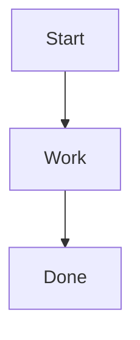
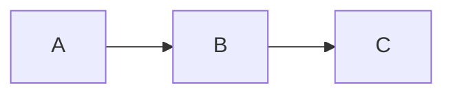
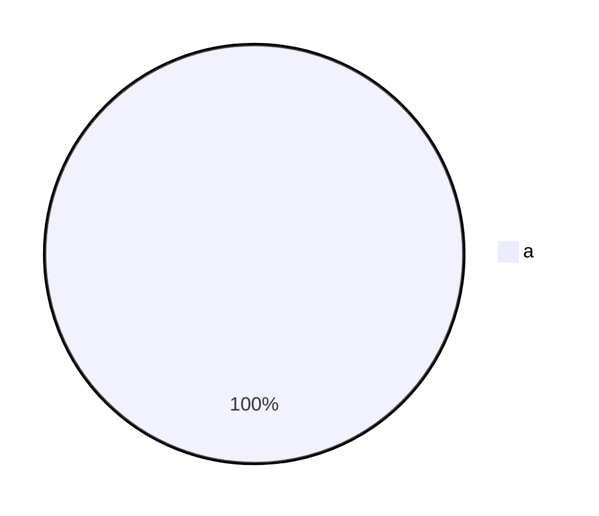
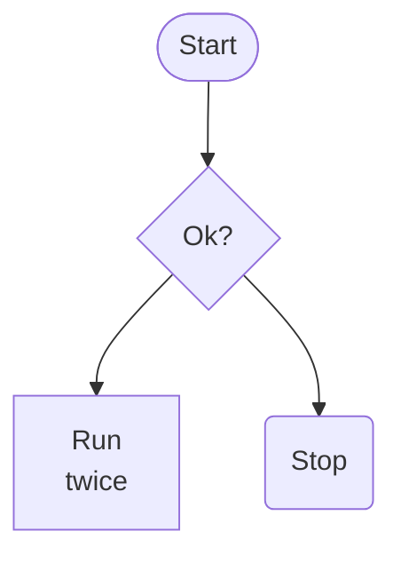

Top down:

```mermaid
graph TD
  A[Start] --> B[Work]
  B --> C[Done]
```

Left to right:

```mermaid
flowchart LR
  A --> B --> C
```

Not drawn:

```mermaid
pie
  "a" : 1
```

Shapes:

```mermaid
graph TD
  A([Start]) --> B{Ok?}
  B --> C["Run<br/>twice"]
  B --> D(Stop)
```
