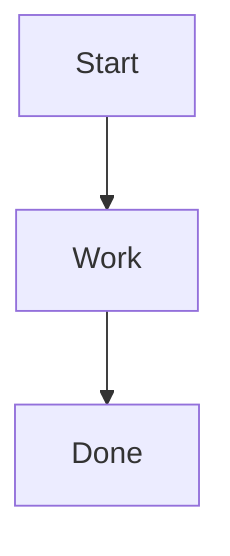
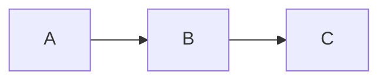
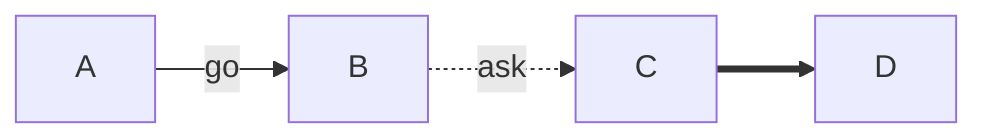

Top down:

```mermaid
graph TD
  A[Start] --> B[Work]
  B --> C[Done]
```

Left to right:

```mermaid
flowchart LR
  A --> B --> C
```

Not drawn:

```mermaid
gantt
  title Plan
```

Shapes:

```mermaid
graph TD
  A([Start]) --> B{Ok?}
  B --> C["Run<br/>twice"]
  B --> D(Stop)
```

Edges:

```mermaid
graph LR
  A -->|go| B -.->|ask| C ==> D
```
