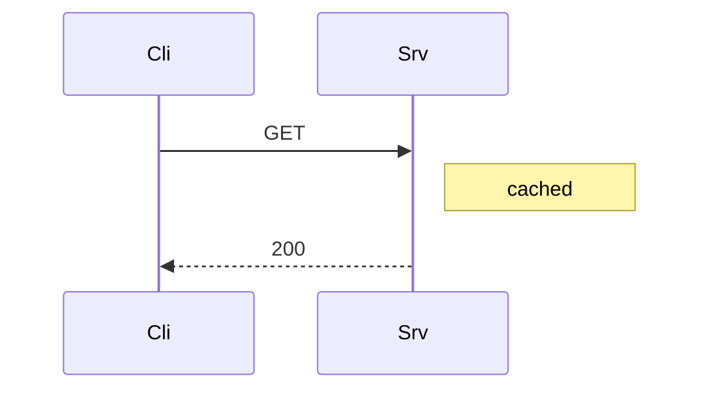
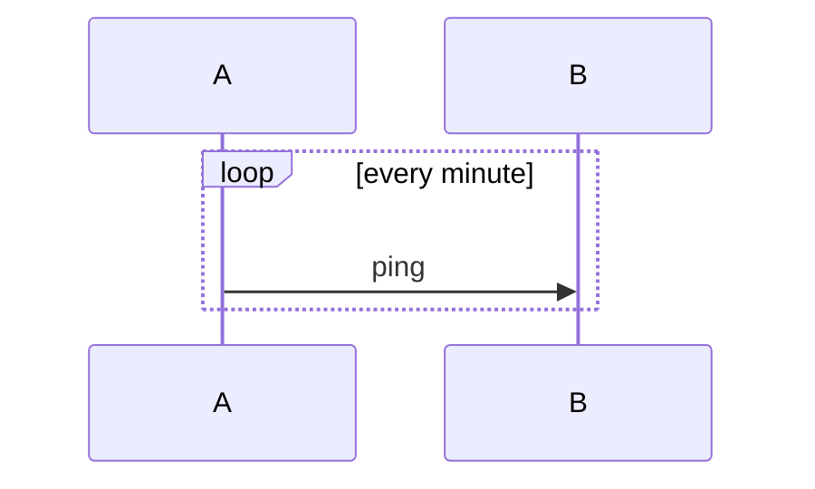

Messages and a note:

```mermaid
sequenceDiagram
  participant C as Cli
  participant S as Srv
  C->>S: GET
  Note right of S: cached
  S-->>C: 200
```

Not drawn (loop):

```mermaid
sequenceDiagram
  loop every minute
    A->>B: ping
  end
```
